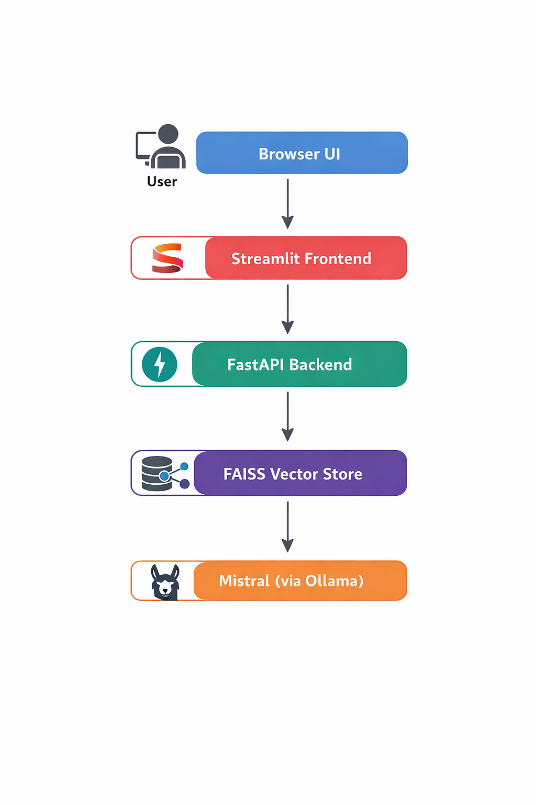

# 📄 Document QnA RAG System (Local LLM + FastAPI + Streamlit)

## 🚀 Overview

This project implements a **Retrieval-Augmented Generation (RAG)** system that allows users to:

- Upload PDF documents
- Ask questions about the document
- Receive context-aware answers generated by a local LLM

The system uses semantic search with FAISS and generates responses using a locally hosted Mistral model via Ollama.

This project demonstrates full-stack GenAI system design with backend API architecture and frontend integration.

---

## 🏗 Architecture

The system follows a layered architecture:

User (Browser UI)
        ↓
Streamlit Frontend
        ↓
FastAPI Backend
        ↓
FAISS Vector Store
        ↓
Local LLM (Mistral via Ollama)

---

## 🧠 How RAG Works in This Project

1. PDF is uploaded via API
2. Text is extracted using `pypdf`
3. Text is split into chunks
4. Chunks are converted into embeddings using `sentence-transformers`
5. Embeddings are stored in FAISS vector database
6. User question is embedded
7. Relevant chunks are retrieved
8. Retrieved context is sent to local Mistral model
9. Final answer is generated and returned

---

## ⚙ Tech Stack

- FastAPI (Backend API)
- Streamlit (Frontend UI)
- FAISS (Vector Database)
- SentenceTransformers (Embeddings)
- Mistral (LLM via Ollama)
- Python

---

## 📦 Installation

### 1️⃣ Clone the repository
git clone https://github.com/sakthee30/document-qna-rag-local
cd document_qna_rag_local

### 2️⃣ Create Virtual environment
python -m venv venv
venv\Scripts\activate   # Windows

### 3️⃣ Install Dependencies
pip install -r requirements.txt

### 4️⃣ Install Ollama and pull Mistral model
ollama pull mistral

## ▶️ How to Run the Project
# Start Backend
uvicorn app.main:app --reload

# Backend runs at
uvicorn app.main:app --reload

# Swagger Docs
http://127.0.0.1:8000/docs

# Start Frontend
# Open a new terminal
cd frontend
streamlit run app.py

# Frontend runs at
http://localhost:8501

### 📡 API Endpoints
# POST /upload-pdf
Uploads and processes a PDF document.

# POST /ask
Accepts a question and returns a generated answer based on document context.